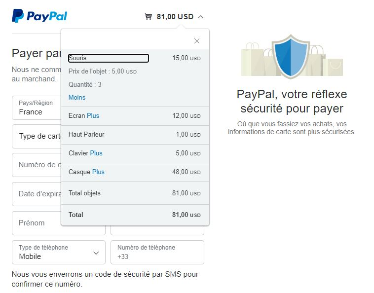

# Panier d'achat en ligne
> C'est mon premier projet pour apprendre la technologie ES6 qui a été réalisé pour tester et mémoriser des connaissances acquises à partir des cours en ligne sur la structure de base des codes développés avec html,css et javascript. Ce test m'a permis de voir où sont mes forces, où et sur quelles parties de ce nouveau langage je devais travailler plus.

## Table des matiéres
* [Demo](#demo)
* [Technologies](#technologies)
* [Fonctionnalités](#fonctionnalités)
* [Code](#ode)
* [Statut](#statut)
* [Contact](#contact)
* [Licence](#Licence)

## Demo
Cliquez sur ce lien [Mon panier](https://manelkhayat.github.io/ManelKhayat_Panier-achat-en-ligne_ES6/) pour voir une démonstration de mon travail.

## Technologies
* HTML5 
* CSS3
* ES6 (Style de codage : Vanilla JavaScript)

## Fonctionnalités
Listes des fonctionnalités réalisées : 
* Ajouter un article au panier
* Augmenter ou diminuer la quantité des articles dans le panier
* Supprimer un article du panier
* Vider le contenu du panier
* Payer avec Paypal 

## Code
Code origine de la fonction checkout (paiement) avec Paypal a été pris à partir de : [Paypal developer](https://developer.paypal.com/docs/paypal-payments-standard/integration-guide/cart-upload/#implement-the-cart-upload-command)

Redirection vers le site de Paypal :

## Statut
Projet fini.

## Contact
Crée par [@Manel Khayat](https://www.linkedin.cn/in/manel-khayat-413b91184/) - N'hésitez pas à me contacter !

## Licence
MIT
